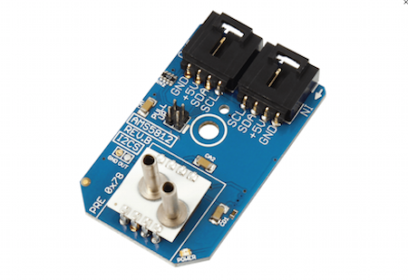

[](https://www.controleverything.com/content/Pressure?sku=AMS5812_I2CS_1000-D)
# AMS5812_I2CS_1000-D
AMS5812_1000-D Amplified Pressure Sensor 

The AMS5812_1000-D is a high-precision OEM pressure Sensor.

This Device is available from ControlEverything.com [SKU: AMS5812_I2CS_1000-D]

https://www.controleverything.com/content/Pressure?sku=AMS5812_I2CS_1000-D

This Sample code can be used with Raspberry pi, Arduino and Beaglebone Black.

## Java
Download and install pi4j library on Raspberry pi. Steps to install pi4j are provided at:

http://pi4j.com/install.html

Download (or git pull) the code in pi.

Compile the java program.
```cpp
$> pi4j AMS5812.java
```

Run the java program.
```cpp
$> pi4j AMS5812
```

## Arduino
Download and install Arduino Software (IDE) on your machine. Steps to install Arduino are provided at:

https://www.arduino.cc/en/Main/Software

Download (or git pull) the code and double click the file to run the program.

Compile and upload the code on Arduino IDE and see the output on Serial Monitor.

## Particle Photon
Login to your Photon and setup your device according to steps provided at:

https://docs.particle.io/guide/getting-started/connect/photon/

Download (or git pull) the code. Go to online IDE and copy the code.

https://build.particle.io/build/

Verify and flash the code on your Photon. Code output is shown in logs at dashboard:

https://dashboard.particle.io/user/logs

## C
Setup your BeagleBone Black according to steps provided at:
 
https://beagleboard.org/Getting-Started
 
Download (or git pull) the code in Beaglebone Black.

Compile the c program.
```cpp
$>gcc AMS5812.c -o AMS5812
```
Run the c program.
```cpp
$>./AMS5812
```
#####The code output is the pressure in PSI and temperature in degree celsius and fahrenheit.
